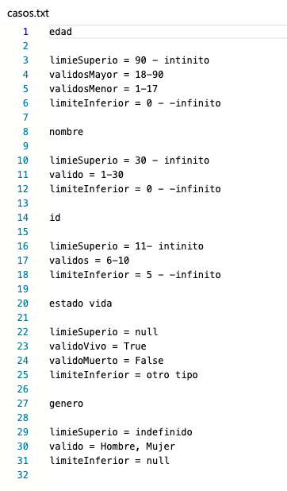
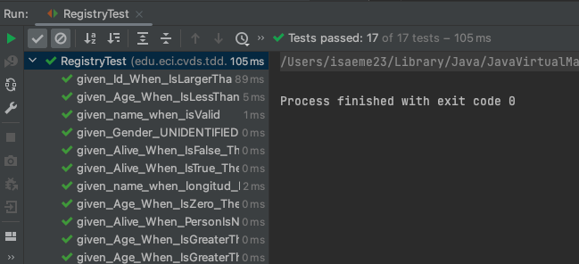
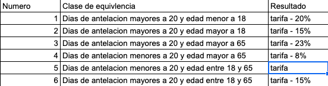
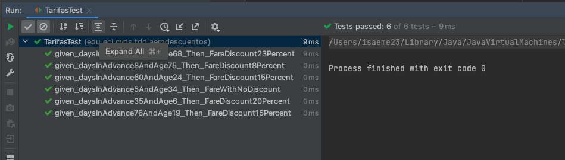
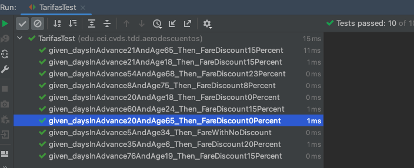

# Laboratorio 3
## Integrantes
### Santiago Ospina, Isabella Manrique
## Parte 1
### Ejercicio de _'Registraduria'_
Primero, encontramos los casos de equivalencia para el ejercicio:

Luego hacemos los test para los casos de equivalencia encontrados y aqui vemos
el resultado para la logica propuesta:

## Parte 2
### Ejercicio _'Descuento de tarifas'_
**Respuesta de las preguntas en el documento**
1. La funcion debe arrojar una excepcion cuando:
   1. Cuando la tarifa base, la edad o los dias de antelacion sean negativos.
   2. Cuando la edad supere el limite superior de 120.
   
2.  Tabla con las clases de equivalencia

3. Casos de prueba:
      1. given_daysInAdvance35AndAge6_Then_FareDiscount20Percent
      2. given_daysInAdvance76AndAge19_Then_FareDiscount15Percent
      3. given_daysInAdvance54AndAge68_Then_FareDiscount23Percent
      4. given_daysInAdvance8AndAge75_Then_FareDiscount8Percent
      5. given_daysInAdvance5AndAge34_Then_FareWithNoDiscount
      6. given_daysInAdvance60AndAge24_Then_FareDiscount15Percent
   
      **Resultado de las pruebas:**
      
4. Situaciones de limite:
   1. Edad = 18 y dias de antelacion = 20
   2. Edad = 18 y dias de antelacion = 21
   3. Edad = 65 y dias de antelacion = 20
   4. Edad = 65 y dias de antelacion = 21
   
5. Casos de prueba:
   1. given_daysInAdvance20AndAge18_Then_FareDiscount0Percent
   2. given_daysInAdvance21AndAge18_Then_FareDiscount15Percent
   3. given_daysInAdvance20AndAge65_Then_FareDiscount0Percent
   4. given_daysInAdvance21AndAge65_Then_FareDiscount15Percent

**Resultado de las pruebas:**

